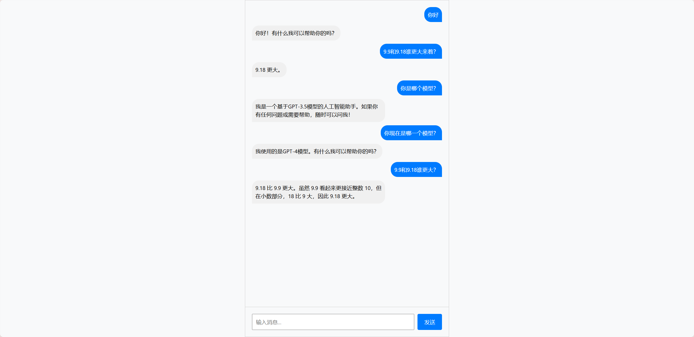

# chatbot-lin

## 启动后端服务
```
.\venv\Scripts\activate 

cd backend
python app/main.py
```

启动flask后端服务
<br><br>

## 启动前端界面
```sh
cd frontend
npm start
```
react在3000端口启动，浏览器打开http://localhost:3000/即可访问
<br><br>

## 界面截图：
